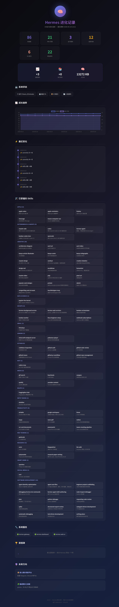

# Hermes 进化日志

我的 AI 助手 Hermes 的成长记录。每天自动更新，打开 HTML 就能看到进化历程。



## 快速查看

Windows 浏览器打开：
```
\\wsl.localhost\Ubuntu-24.04\home\rng\projects\hermes-evolution\index.html
```
或者
```
file:///home/rng/projects/hermes-evolution/index.html
```

## 技术栈

| 工具 | 用途 |
|------|------|
| **Python** | 数据采集 + HTML 生成 |
| **Chart.js** | 趋势图绘制 |
| **Noto Sans SC** | 中文字体 |
| **CSS Grid/Flexbox** | 响应式布局 |

## 项目结构

```
hermes-evolution/
├── index.html             # 进化日志主页（自动生成）
├── screenshots/           # 页面预览截图
├── data/
│   └── evolution.json     # 历史数据（每日快照）
├── scripts/
│   ├── config.py          # 路径配置
│   ├── collect.py         # 数据采集（每日定时运行）
│   └── render.py          # HTML 渲染模板
├── VERSION                # 版本号
├── CHANGELOG.md           # 更新日志
├── README.md
└── .gitignore
```

## 追踪的数据

| 指标 | 内容 |
|------|------|
| 🛠️ 技能数 | Hermes 已安装的技能数量 |
| 📚 Wiki 页面 | 知识库的页面数量 |
| 🔧 系统服务 | Hermes gateway/dashboard/web-ui 运行状态 |
| ⏱ 系统运行时间 | WSL 开机时长 |
| 💾 磁盘使用率 | 磁盘空间占用 |
| 📦 Git 提交数 | 项目自身的提交次数 |
| ⚡ 每日变化 | 各项指标的增减变化 |
| 🏆 里程碑 | 手动记录的重要时刻 |

## 添加里程碑

直接告诉 Hermes：
```
添加里程碑：今天学会了 Git 基础操作
```

## 每日自动更新

每天 9:00 由 Hermes 定时任务自动采集数据并更新页面。

## 版本记录

查看 [CHANGELOG.md](CHANGELOG.md) 了解完整更新历史。

当前版本记录在 `VERSION` 文件中。升级版本：
```bash
echo "0.7.0" > VERSION
# 然后提交
```

## 修改指南

想改页面样式？编辑 `scripts/render.py` 里的 CSS 和 HTML 模板。
想加追踪数据？编辑 `scripts/collect.py` 的 `snapshot` 字典。
想改路径配置？编辑 `scripts/config.py`。
